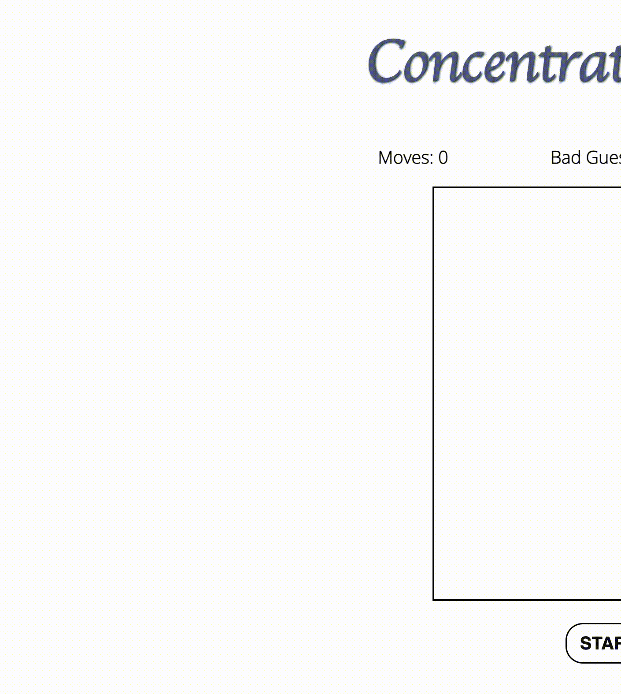

<h1 align="center">Concentration</h1>

<h2 align= "center"> Concentration - A Memory Game. </h2>

<h2 align = "center"><a href="https://tcjiao.github.io/Concentration/">🚀 🚀 🚀 Play Now 🚀 🚀 🚀</a> </h2>

## 📝 Description

This game will test your Concentration!

Memorize the board of cards and try to match pairs as fast as you can and with as few flips as possible.

## 📸 Preview

## 🖥️ Technologies Used

## 🎯 How To Play
- Click the **Start** Button to start the game.
- You can **Reset** game anytime.
- Flip two cards on the board and memorize them.
- Winning condition:
  - Pair **ALL** cards.
- Losing condition:
  - Bad guess more than 10 times.
  - Time is out.
- Play again

## 🌱 Upcoming Features
- [ ] Adding more difficulty levels for player to choose.
- [ ] Giving scores based on how fast player winning the game.
- [ ] Allow two or more players compete with each other.

