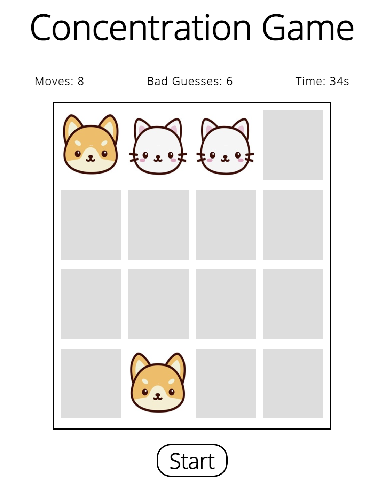

# Concentration
A memory game

Click <a href="https://tcjiao.github.io/Concentration/">Here</a> to play!

## Screenshots

## Technologies Used

## Getting Started
- Click Start Button to start the game.
- Pick two cards on the board and memorize them if they're not the same.
- Pair all cards and win the game!

## Future Enhancements
- Adding difficulty level change.

